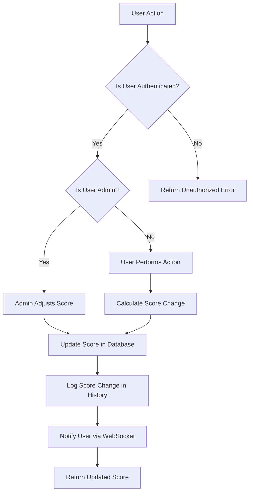

### Score Module

##### Overview

A module manage score of User

##### Hight level Requirements

- Manage user score
- Store score history with timestamps (for audit purposes)
- Provide API for score board (top N user's scores)
- Live updates on score changes
- Admin controls for score adjustments
- User only access to their own score and only view score board (Cannot modify their own score directly)
- Score incrementation/decrementation based on specific actions (e.g., completing tasks, penalties)

##### Low level Requirements

- Data Model:
  - User: id, name, email
  - Score: user_id, score_value, timestamp
  - ScoreHistory: user_id, score_change, reason, timestamp
- API Endpoints:
  - GET /score/{user_id}: Retrieve current score for a user
  - PUT /score/{user_id}/adjust: Admin endpoint to adjust user score
  - GET /scoreboard?top=N: Retrieve top N users by score
  - GET /score/history/{user_id}: Retrieve score history for a user
  - PUT /score/{user_id}/action: Endpoint to modify score based on user actions
- Real-time Updates:
  - WebSocket endpoint for live score updates
- Authentication & Authorization:
  - JWT-based authentication
  - Role-based access control (Admin vs User)
- Score Adjustment Logic:
  - Functions to increment/decrement score based on predefined actions
  - Validation to prevent unauthorized score changes

##### Flow Diagram

